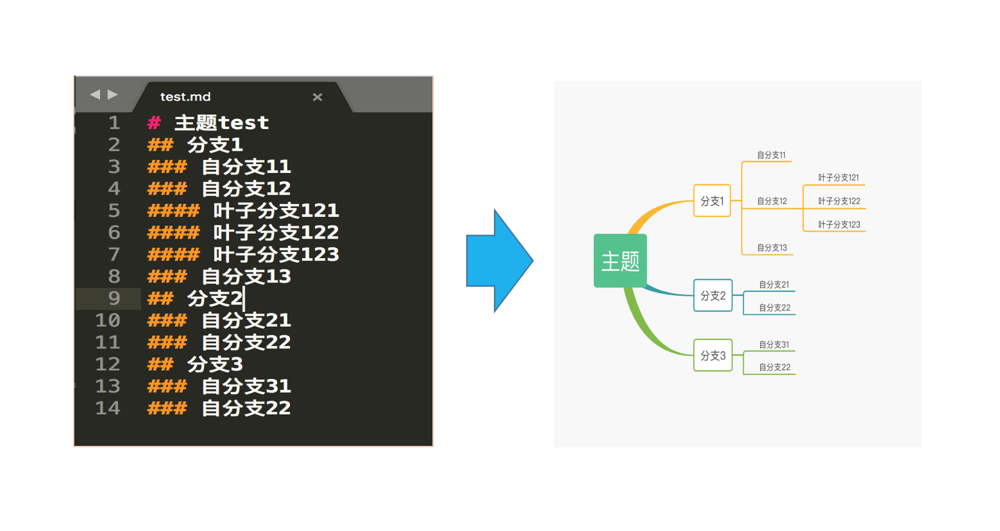

# MD2Xmind



A Python package to convert Markdown documents to XMind mindmap format. This tool allows you to transform your structured Markdown content into visual mindmaps that can be opened in XMind or other compatible mindmap applications.

## Features

- ✅ Convert Markdown files to XMind format
- ✅ Support for multiple heading levels (H1-H6)
- ✅ Preserve hierarchical structure
- ✅ Command-line interface
- ✅ Python API for programmatic usage
- ✅ Compatible with XMind versions < 8
- ✅ Clean and simple API

## Installation

Install md2xmind using pip:

```bash
pip install md2xmind
```

### Upgrade to latest version

```bash
pip install -U md2xmind
```

## Quick Start

### Command Line Usage

Convert a Markdown file to XMind format:

```bash
# Basic usage
md2xmind input.md

# Specify output file and topic name
md2xmind input.md -o output.xmind -t "My Mindmap"

# Get help
md2xmind --help
```

### Python API Usage

#### Convert a Markdown file

```python
import md2xmind

# Convert file with custom topic name
md2xmind.start_trans_file('input.md', 'output.xmind', 'My Mindmap')

# Convert file with auto-generated topic name
md2xmind.start_trans_file('input.md', 'output.xmind')
```

#### Convert Markdown content string

```python
import md2xmind

markdown_content = """
# Main Topic

## Subtopic 1
### Detail 1.1
### Detail 1.2

## Subtopic 2
### Detail 2.1
#### Sub-detail 2.1.1
"""

md2xmind.start_trans_content(markdown_content, 'output.xmind', 'My Mindmap')
```

#### Using the Md2Xmind class directly

```python
from md2xmind import Md2Xmind

# Process file
Md2Xmind.process_file('input.md', 'output.xmind', 'Topic Name')

# Process content
Md2Xmind.process_content(markdown_content, 'output.xmind', 'Topic Name')
```

## Markdown Structure

The tool processes Markdown headers to create the mindmap structure:

```markdown
# Root Topic (becomes the central topic)

## Level 1 Branch
### Level 2 Branch
#### Level 3 Branch
##### Level 4 Branch
###### Level 5 Branch

## Another Level 1 Branch
### Another Level 2 Branch
```

**Note:** Only heading elements (`#`, `##`, `###`, etc.) are processed. Other Markdown elements like lists, links, and text formatting are currently ignored to maintain a clean mindmap structure.

## Requirements

- Python >= 3.6
- xmind >= 1.2.0

## Examples

Check the `example/` directory for more usage examples:

```bash
cd example/
python Demo.py
```

## API Reference

### Functions

#### `start_trans_file(md_file, target_file_name, topic_name='')`

Convert a Markdown file to XMind format.

**Parameters:**
- `md_file` (str): Path to the input Markdown file
- `target_file_name` (str): Path for the output XMind file
- `topic_name` (str, optional): Main topic name for the mindmap

**Returns:**
- `str`: Path to the generated XMind file

#### `start_trans_content(md_content, target_file_name, topic_name='')`

Convert Markdown content string to XMind format.

**Parameters:**
- `md_content` (str): Markdown content as a string
- `target_file_name` (str): Path for the output XMind file  
- `topic_name` (str, optional): Main topic name for the mindmap

**Returns:**
- `str`: Path to the generated XMind file

### Class Methods

#### `Md2Xmind.process_file(md_file_path, target_file_name, topic_name='')`

Process a Markdown file and convert it to XMind format.

#### `Md2Xmind.process_content(md_content, target_file_name, topic_name='')`

Process Markdown content string and convert it to XMind format.

## Compatibility

- Supports XMind versions prior to 8.0
- Compatible with Python 3.6+
- Works on Windows, macOS, and Linux

## Contributing

Contributions are welcome! Please feel free to submit a Pull Request.

1. Fork the repository
2. Create your feature branch (`git checkout -b feature/AmazingFeature`)
3. Commit your changes (`git commit -m 'Add some AmazingFeature'`)
4. Push to the branch (`git push origin feature/AmazingFeature`)
5. Open a Pull Request

## License

This project is licensed under the MIT License - see the [LICENSE](LICENSE) file for details.

## Changelog

### Version 2.0.0
- ✅ Removed Flask web server dependencies
- ✅ Simplified to core conversion functionality only
- ✅ Added command-line interface
- ✅ Improved error handling and documentation
- ✅ Better code organization and structure
- ✅ Enhanced Markdown parsing logic

### Version 1.x
- Basic Markdown to XMind conversion
- Web interface (deprecated)

## Author

- **Tan_928** - [GitHub](https://github.com/tan-928)

## Support

If you encounter any issues or have questions, please [open an issue](https://github.com/tan-928/md2xmind/issues) on GitHub.


